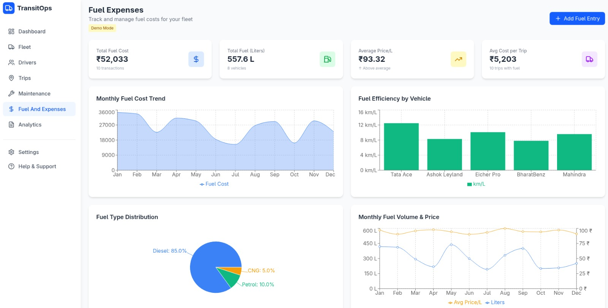

<div align="center">

# 🚍 TransitOps

**Fleet & transit operations management platform**


</div>

---

## 📖 About

TransitOps is a platform for organizations to manage their transit fleet — drivers, vehicles, trips, fuel, maintenance, and reporting — from a single dashboard. It's split into a Node/Express + PostgreSQL backend and two React (Vite) frontend apps.

---

## 🖥️ Screenshot

<div align="center">
  
  <p><em>Officer Dashboard</em></p>
</div>

---

## 🧱 Tech Stack

| Layer      | Stack                                                                |
|------------|-----------------------------------------------------------------------|
| Frontend   | React 19 · Vite · Tailwind CSS · React Router · Recharts · Framer Motion |
| Backend    | Node.js · Express 5 · PostgreSQL · JWT (httpOnly cookies) · bcrypt    |
| Infra      | Docker Compose (Postgres + pgAdmin)                                   |
| Security   | Helmet, hashed passwords, httpOnly cookie sessions, request size limits |

---

## 📁 Project Structure

```
Odoo_TransitOps/
├── Dashboard.jpeg
├── backend/
│   ├── server.js
│   ├── docker-compose.yml
│   └── src/
│       ├── config/          # DB connection + migration runner
│       ├── controllers/     # organization, organizationUser, driver, vehicle,
│       │                    # trip, fuel, maintenance, document, notification,
│       │                    # settings, dashboard
│       ├── middleware/      # JWT auth middleware
│       ├── migrations/      # SQL migration files (001–010)
│       └── routes/          # Express route definitions
└── frontend/
    ├── Officer/             # Officer-facing app: login, register, dashboard
    │   └── src/pages/       # + Drivers, Vehicles, Trips, Reports (scaffolded)
    └── organizations/       # Organization-facing app: login, register, dashboard
```

---

---

## ⚙️ Getting Started

### Prerequisites

- Node.js v18+
- Docker & Docker Compose
- npm

### 1. Clone the repo

```bash
git clone https://github.com/akashverma712/Odoo_TransitOps.git
cd Odoo_TransitOps
```

### 2. Configure environment variables

Create `backend/.env`:

```shellscript
PORT=xxxx
DB_PORT=xxxx
DB_USER=xxxx
DB_PASSWORD=xxxx
DB_HOST=xxxx
DB_NAME=xxxx
JWT_SECRET=xxxx
NODE_ENV=xxxx
BCRYPT_ROUNDS=xxxx
```

> 💡 Use `DB_HOST=localhost` for the Docker Compose setup below. Generate a strong random string for `JWT_SECRET` — never commit real secrets.

### 3. Spin up the database

```bash
cd backend
docker-compose up -d
```

| Service   | URL                     | Notes                              |
|-----------|--------------------------|-------------------------------------|
| Postgres  | `localhost:5432`         | Configured via `.env`               |
| pgAdmin   | `localhost:8080`         | `admin@admin.com` / `adminpassword` |

### 4. Install deps & run migrations

```bash
npm install
npm run migrate
```

### 5. Start the backend

```bash
npm run dev
```
Runs at `http://localhost:<PORT>`.

### 6. Start a frontend

Pick one of the two apps:

```bash
# Officer app (recommended — fully connected)
cd ../frontend/Officer
npm install
npm run dev
```

```bash
# Organizations app
cd ../frontend/organizations
npm install
npm run dev
```

Both run at `http://localhost:5173` by default (Vite).

---

## 🔌 API Reference (currently mounted)

| Method | Endpoint                        | Auth | Description                     |
|--------|-----------------------------------|:----:|-----------------------------------|
| POST   | `/api/organization/register`      | ✅  | Register a new organization       |
| POST   | `/api/organization/login`         | ✅  | Log in, sets JWT httpOnly cookie  |
| GET    | `/api/organization/me`            | ✅   | Get the logged-in org's profile   |
| POST   | `/api/organization/logout`        | ✅   | Clear the session cookie          |
| POST   | `/api/organization/users`         | ✅   | Create a staff account under the org |

**Example — register:**
```bash
curl -X POST http://localhost:<PORT>/api/organization/register \
  -H "Content-Type: application/json" \
  -d '{
    "organization_name": "Acme Transit",
    "organization_type": "Private",
    "number_of_workers": 25,
    "owner_name": "Jane Doe",
    "password": "yourpassword",
    "is_registered": true
  }'
```

---

## 🤝 Contributing

1. Fork the repo
2. Create a feature branch 
3. Commit your changes
4. Open a PR against `main`

